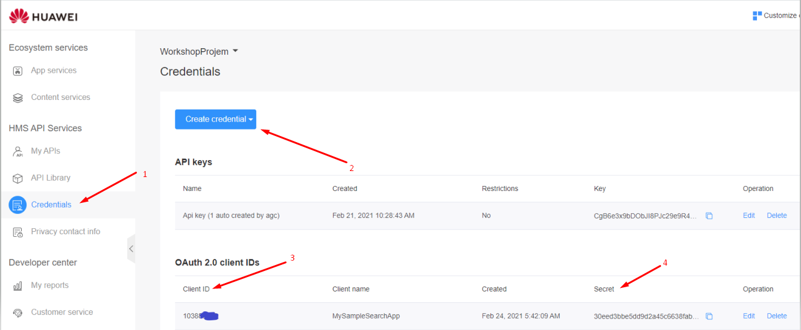
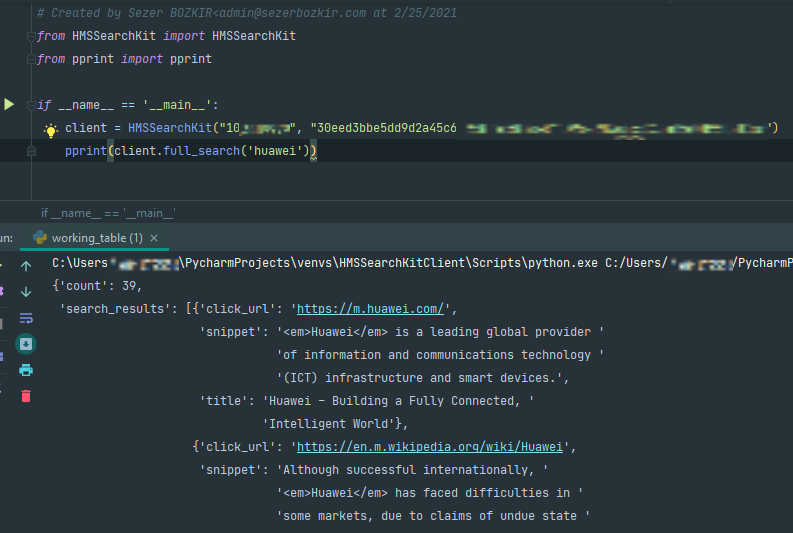
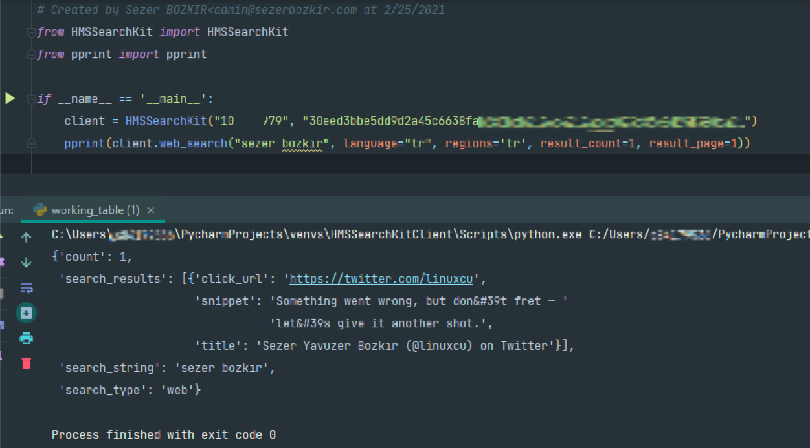
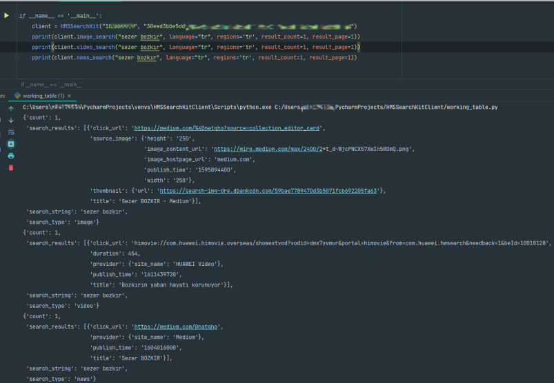

# HMS Search Kit Python Client

It is a library developed to use HMS Search Kit on the server side of your applications.

## How to Install Your Application?

```bash
pip install git+https://github.com/Natgho/HMS-Search-Kit-Python-Client.git@master
```

or download github repo and go to folder location:

```bash
pip install .
```

## How to Use?

There are 4 different search types as it progresses in parallel with the client documentation.

1. Web Search
2. Image Search
3. Video Search
4. News Search
5. Full Search (It allows you to make all other calls with a single command.)

### Get Client-ID and Client-Secret from AppGallery Console

[Please follow this instructions for create Client ID and Client Secret](https://developer.huawei.com/consumer/en/doc/start/api-0000001062522591)

**Note:** Don't forget the activate "Search Kit" into your application.

#### Summary:

**Activation:**

AppGallery Console -> My Projects -> [PROJECT_NAME] -> Project Settings -> Manage APIs -> Search Kit

**Get Credentials from AGC:**



### Sample Usage

Simple One:



Search Types:





